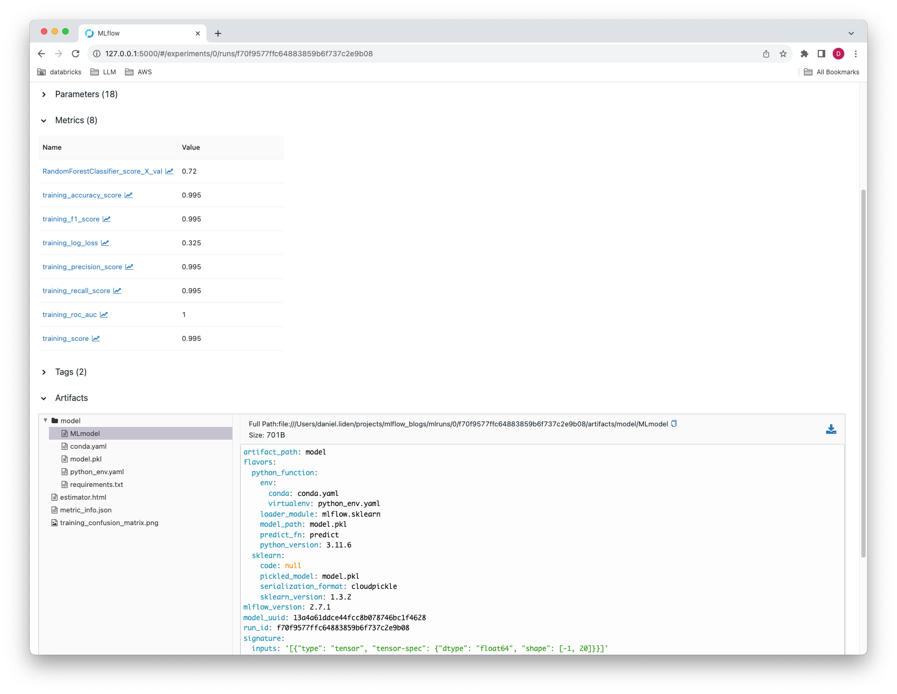
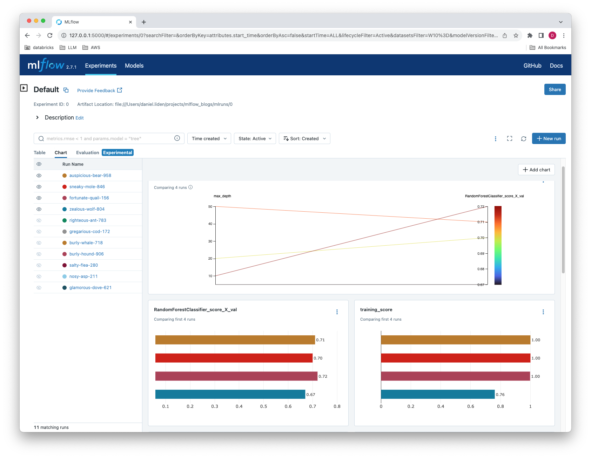

Looking to learn more about the autologging functionality included in MLflow? Look no further than this primer on the basics of using this powerful and time-saving feature!

# Introduction to [mlflow.autolog](https://www.mlflow.org/docs/latest/tracking/autolog.html)

Robust logging practices are central to the iterative development and improvement of machine learning models. Carefully tracking metrics, parameters, and artifacts can be challenging when working with complex machine learning libraries or when experimenting with multiple different frameworks with varying APIs and selections of different objects and values to track.

MLflow’s **automatic logging functionality** offers a simple solution that is compatible with many widely-used machine learning libraries, such as [PyTorch](https://mlflow.org/docs/latest/python_api/mlflow.pytorch.html), [Scikit-learn](https://mlflow.org/docs/latest/python_api/mlflow.sklearn.html#mlflow.sklearn.autolog), and [XGBoost](https://mlflow.org/docs/latest/python_api/mlflow.xgboost.html#mlflow.xgboost.autolog). Using `mlflow.autolog()` instructs MLflow to capture essential data without requiring the user to specify what to capture manually. It is an accessible and powerful entrypoint for MLflow’s logging capabilities.

To enable automatic logging, simply add the following line to your machine learning scripts/notebooks, before initiating activities like model training or evaluation that may include information or artifacts you would like to log:

```python
import mlflow


mlflow.autolog()
```

## Autolog features

When a data science workflow includes `mlflow.autolog()`, MLflow will automatically log:

- **Metrics**: standard training and evaluation measures such as accuracy and F1 score;
- **Parameters**: hyperparameters, such as learning rate and number of estimators; and
- **Artifacts**: important files, such as trained models.

MLflow’s automatic logging captures details tailored to the specific activities of the library being used: different libraries will result in different logged objects and data. In addition, MLflow logs key metadata such as software versions, a git commit hash, and the file name from which the run was initiated. By documenting the system's state during model training, MLflow aims to facilitate environment reproducibility and provide audit lineage, minimizing the possibility of inference issues that could arise from package regressions or deprecations in newer library versions.

The specifics of what is captured through automatic logging depend on the libraries used. Additionally, MLflow captures contextual metadata such as software versions, git commit hash, and the name of the file from which the run was launched. By logging as much detail as possible about the state of the system that trained the model, MLflow can offer environment reproducibility and audit lineage, minimizing the possibility of inference issues resulting from, for example, package regressions or deprecations.

## Basic Usage of `mlflow.autolog`

You can access auto logging functionality in two different ways:

1. Via the `mlflow.autolog()` function, which enables and configures automatic logging across all supported libraries. This provides a broad, one-size-fits-all approach when working with multiple libraries and is ideal for prototyping and exploratory analysis of a machine learning pipeline.
2. Via the library-specific autolog functions, such as `mlflow.sklearn.autolog()`, which enable finer-grained logging configuration for individual libraries. For example, `mlflow.pytorch.autolog()` includes the `log_every_n_epoch` and `log_every_n_step` arguments for specifying how often to log metrics.

Regardless of which of these two approaches you use, you do not need to manually initialize an MLflow run with [start_run()](https://www.mlflow.org/docs/latest/python_api/mlflow.html#mlflow.start_run) in order to have a run created and for your model, parameters, and metrics to be captured in MLflow.

### Example

```python
import mlflow
from sklearn import datasets
from sklearn.ensemble import RandomForestClassifier
from sklearn.model_selection import train_test_split

# Generate a 3-class classification problem
X, y = datasets.make_classification(
    n_samples=1000,
    class_sep=0.5,
    random_state=42,
    n_classes=3,
    n_informative=3,
)

# Split the data into training and validation sets
X_train, X_val, y_train, y_val = train_test_split(X, y, test_size=0.2, random_state=42)

# Enable autolog
mlflow.autolog()  # or mlflow.sklearn.autolog()

# Initialize the classifier with n_estimators=200 and max_depth=10
clf = RandomForestClassifier(n_estimators=200, max_depth=10)

# Fit the classifier to the data.
# The `fit` method is patched to perform autologging. When engaged in training, a
# run is created and the parameters are logged.
# After the fit is complete, the model artifact is logged to the run.
clf.fit(X_train, y_train)

# Score the model on the data
# The current active run is retrieved during calling `score` and the loss metrics are logged
# to the active MLflow run.
clf.score(X_val, y_val)

# Visualize the automatically logged run results to validate what we recorded
mlflow.last_active_run()
```

The above logs model parameters, metrics, and the model to an MLflow run. The output result of the final statement ([mlflow.last_active_run()](https://www.mlflow.org/docs/latest/python_api/mlflow.html#mlflow.last_active_run)) in the above example, which will return data from the run on model metrics, parameters, and logged artifacts (results truncated) is as shown below:

```text
<Run: data=<RunData:
metrics={'RandomForestClassifier_score_X_val': 0.72,
         'training_accuracy_score': 0.99625,
         'training_f1_score': 0.9962547564333545,
         'training_log_loss': 0.3354604497935824,
         'training_precision_score': 0.9962921348314606,
         'training_recall_score': 0.99625,
         'training_roc_auc': 0.9998943433719795,
         'training_score': 0.99625
         },
 params={'bootstrap': 'True',
         'ccp_alpha': '0.0',
         'class_weight': 'None',
         'criterion': 'gini',
         'max_depth': '10',
         'max_features': 'sqrt',
         'max_leaf_nodes': 'None',
         [...],
         },
tags={'estimator_class': 'sklearn.ensemble._forest.RandomForestClassifier',
      'estimator_name': 'RandomForestClassifier',
      'mlflow.autologging': 'sklearn',
      [...]
}, [...]>>
```

You can also access these in the mlflow ui by executing [mlflow ui](https://www.mlflow.org/docs/latest/tracking.html#tracking-ui) on a command line terminal.



The MLflow UI also allows you to graphically compare different metrics and parameters across multiple runs, including those generated via `mlflow.autolog`.



## Configuration and Customization

The automatic logging functions take many arguments that give the user greater control over logging behavior. For example, `mlflow.autolog()` includes `log_models` and `log_datasets` arguments (both `True` by default) that specify whether models and dataset information should be saved to the MLflow run, enabling you to specify what is actually logged. To disable automatic logging of datasets while continuing to log all the usual elements, simply disable the autologging of datasets feature by setting `mlflow.autolog(log_datasets=False)` before fitting a model. You can also adjust the behavior of library-specific autolog functions: for example, the `mlflow.sklearn.autolog()` function includes a `max_tuning_runs` argument that specifies how many nested runs to capture when performing hyperparameter searches.

`mlflow.autolog()` can be used in combination with the library-specific autolog functions to control the logging behavior for specific libraries. The library-specific autolog call will always supersede `mlflow.autolog()`, regardless of the order in which they are called. For example, combining `mlflow.autolog()` with `mlflow.sklearn.autolog(disable=True)` will result in automatic logging for all supported libraries except for `scikit-learn`.

It is important to consult the documentation for the specific framework(s) you are using in order to understand what is logged automatically and what configuration options are available. See the [further reading section below](#further-reading) for links.

## Conclusion and Next Steps

MLflow's autologging capabilities and library-specific automatic logging functions provide a straightforward starting point for MLflow tracking with little or no required configuration. They log key metrics, parameters, and artifacts from many popular machine learning libraries, allowing users to track their machine learning workflows without writing custom tracking code.

They are not, however, the right solution for all use cases. If you only need to track a handful of specific metrics, enabling automatic logging may be inefficient, resulting in much more generated data and stored artifacts than needed. Furthermore, automatic logging is not available for every possible framework and custom values one might want to track. In such cases, it might be necessary to [manually specify what to track](https://mlflow.org/docs/latest/tracking/tracking-api.html#logging-functions).

## Further Reading

- [MLflow Documentation on Automatic Logging](https://mlflow.org/docs/latest/tracking/autolog.html)
- [Python API reference for mlflow.autolog](https://mlflow.org/docs/latest/python_api/mlflow.html#mlflow.autolog)
- Python API references for library-specific autolog functions
  - [PyTorch](https://mlflow.org/docs/latest/python_api/mlflow.pytorch.html)
  - [Tensorflow](https://mlflow.org/docs/latest/python_api/mlflow.tensorflow.html#mlflow.tensorflow.autolog)
  - [Scikit-learn](https://mlflow.org/docs/latest/python_api/mlflow.sklearn.html#mlflow.sklearn.autolog)
  - [XGBoost](https://mlflow.org/docs/latest/python_api/mlflow.xgboost.html#mlflow.xgboost.autolog)
  - [PySpark](https://mlflow.org/docs/latest/python_api/mlflow.pyspark.ml.html#mlflow.pyspark.ml.autolog)
  - [Statsmodels](https://mlflow.org/docs/latest/python_api/mlflow.statsmodels.html#mlflow.statsmodels.autolog)
  - [LightGBM](https://mlflow.org/docs/latest/python_api/mlflow.lightgbm.html#mlflow.lightgbm.autolog)
  - [Paddle](https://mlflow.org/docs/latest/python_api/mlflow.paddle.html#mlflow.paddle.autolog)
  - [Fastai](https://mlflow.org/docs/latest/python_api/mlflow.fastai.html#mlflow.fastai.autolog)
